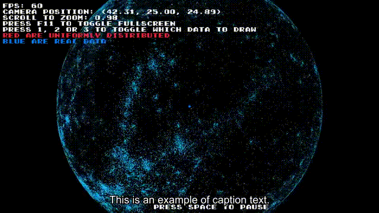
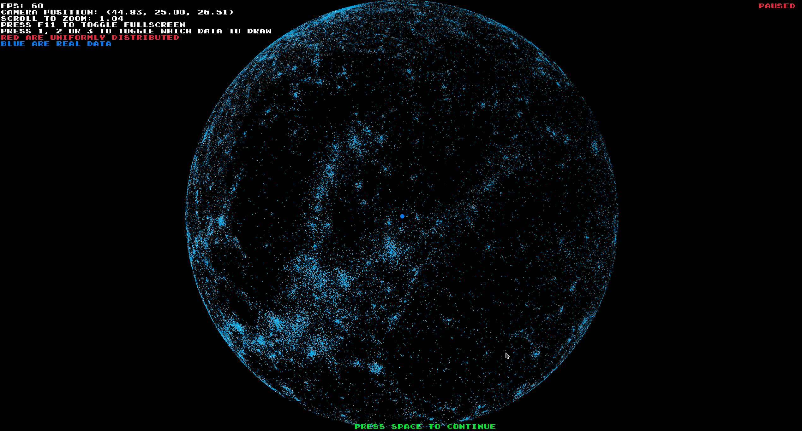

# Galaxy Visualization

Data taken from the course GPU programming at: https://studiehandboken.abo.fi/sv/kurs/IT00CG19/19162?period=2024-2027

Visualization of 100k real galaxies in blue and 100k red randomly distributed galxies.


# Prerequisites
The project has has been setup with CMake, you can build the project with either build.sh, Meson, Make, CMake or build.bat.

```bash
# Tested on:
# Linux 6.10.3-1-MANJARO | x86_64 GNU/Linux

pacman -S base-devel meson git cmake clang  

# Ubuntu
sudo apt-get -y install build-essential meson git cmake clang
```

# Build and run the project

Choose one of the following options:

# Linux:

## Meson - fastest build time
```bash
# Tested on:
# Linux 6.10.3-1-MANJARO | x86_64 GNU/Linux

chmod +x meson_build_and_run.sh   
./meson_build_and_run.sh
```

## CMake with gcc / Clang 
```bash
# Tested on: 
# Linux 6.10.3-1-MANJARO - x86_64 GNU/Linux

# bash gcc / Clang, build and run
./build.sh
```

## Make
```bash
# Tested on:
# Linux 6.10.3-1-MANJARO | x86_64 GNU/Linux

# Build Raylib + Galaxy Visualization + Run the exicutable program
make

# Run the exicutable program, after building
make run

# Only rebuild the Galaxy Visualization
make rebuild

# Clean the build directory
make clean
```

## Windows

```cmd
build.bat
```

# Demo




# Patch notes

-   Space pauses the program
-   Added automated setup support for both Clang and GCC (build.sh)
-   Added automated setup support for Windows through build.bat with cmake
-   Added Makefile for Linux
-   Added Meson build system for Linux
-   Added The Meson build now downloads and builds Raylib

---


