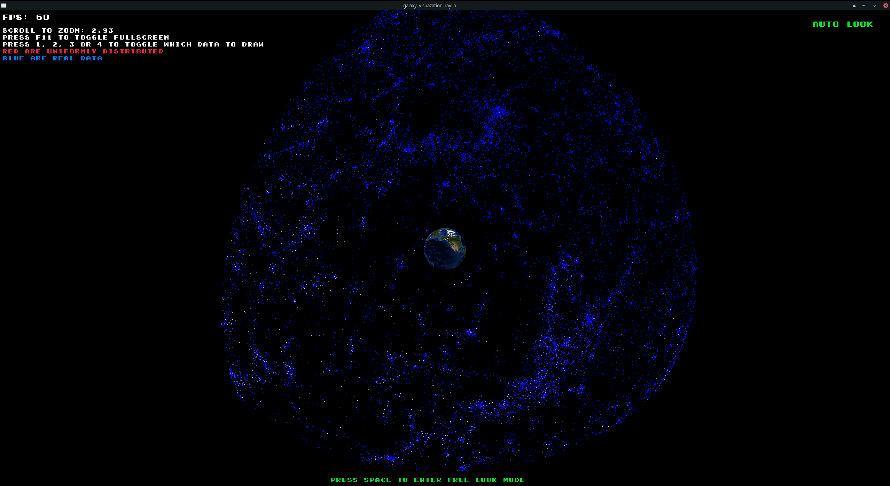

# Galaxy Visualization

Visualization of 100,000 real galaxies in blue and 100,000 randomly distributed galaxies in red.

## The Course

This project visualizes 100,000 real galaxies in blue and 100,000 randomly distributed galaxies in red. The data is sourced from the GPU programming course at  
[Åbo Akademi University](https://studiehandboken.abo.fi/en/course/IT00CG19/19162?period=2024-2027)

This course teaches parallel programming using CUDA. 

The assignment is to use CUDA to calculate 10 billion angles between galaxies and prove they are not randomly distributed. 
The students must leverage the GPU for these calculations on their own using a supercomputer.

The students have to prove this on their own. 

The expected runtime for the calculation is approximately 3 seconds.


This program is a visualization of the data, not the solution to the assignment.

## Prerequisites

This project can be built using plain g++ through build.sh (raylib is the only dependency), Meson, CMake, or Make. 

Below are the installation instructions for the required dependencies:

### Dependencies

- **Raylib**
- **Base Development Tools** (e.g., `build-essential` on Ubuntu)
- **Meson**
- **CMake**
- **Git**
- **Clang** (or GCC)

### Installation Commands

#### Arch Linux

```bash
sudo pacman -S raylib base-devel meson git cmake clang
```

#### Ubuntu

```bash
sudo apt-get install -y raylib build-essential meson git cmake clang
```

### Build and Run the Project

You can choose from one of the following build systems:
- Meson (F5 in VSCode)
- Make with CMake
- build.sh


## Meson
#### Setup:
```bash
meson setup build --buildtype=release 
```

#### Build:
```bash
meson compile -C build
```

#### Run:
```bash
./build/galaxy_visualization_raylib
```

#### Clean:
```bash
meson compile -C build --clean
```


## Make
#### Build:
```bash
make
```

#### Run:
```bash
make run
```

#### Clean:
```bash
make clean
```


##  Demo


---



## Patch Notes

- Spacebar: Pauses the program.
- Added Makefile for Linux.
- Added Meson build system for Linux.
- The Meson build now links against the system-installed Raylib.
- Added earth model: https://science.nasa.gov/resource/earth-3d-model/ | Credit: NASA Visualization Technology Applications and Development (VTAD).
- Added Free Look Mode.
- Redshift data taken from: https://lweb.cfa.harvard.edu/~dfabricant/huchra/zcat/seyfert.dat
- Added build.sh for easy building on Linux. 
- LShift to move slower in free look mode.