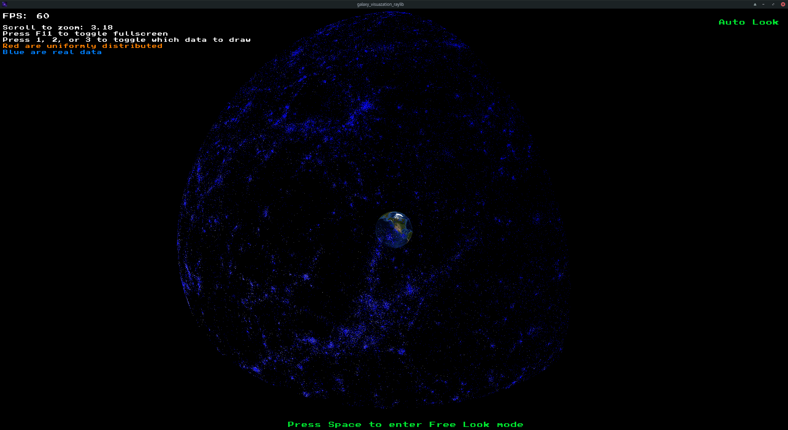

# Galaxy Visualization

Visualization of 100,000 real galaxies in blue and 100,000 randomly distributed galaxies in red.

## The Course

This project visualizes 100,000 real galaxies in blue and 100,000 randomly distributed galaxies in red. The data is sourced from the GPU programming course at  
[Åbo Akademi University](https://studiehandboken.abo.fi/en/course/IT00CG19/19162?period=2024-2027)

This course teaches parallel programming using CUDA. 

The assignment is to use CUDA to calculate 10 billion angles between galaxies and prove they are not randomly distributed. 
The students must leverage the GPU for these calculations on their own using a supercomputer.

The students have to prove this on their own. 

The expected runtime for the calculation is approximately 3 seconds.


This program is a visualization of the data, not the solution to the assignment.

## Prerequisites

This project can be built using plain clang through build.sh (raylib is the only dependency) or Meson.

Below are the installation instructions for the required dependencies:

### Dependencies

- **Raylib**
- **Base Development Tools** (e.g., `build-essential` on Ubuntu)
- **Meson**
- **Git**
- **Clang** (or GCC)
- **gdb** (optional)

### Installation Commands

#### Arch Linux

```bash
sudo pacman -S raylib base-devel meson git clang
```

#### Ubuntu

```bash
sudo apt-get install -y raylib build-essential meson git clang
```

### Build and Run the Project

You can choose from one of the following build systems:
- Meson (F5 in VSCode)
- build.sh


## Meson
```bash
# Setup
meson setup build --buildtype=release 

# Build
meson compile -C build

# Run
./build/galaxy_visualization_raylib

# Clean
meson compile -C build --clean
```

## Bash
```bash
# Build
chmod +x ./build.sh

# Run
./build/galaxy_visualization_raylib
```

##  Demo


---



## Patch Notes
- Added earth model: https://science.nasa.gov/resource/earth-3d-model/ | Credit: NASA Visualization Technology Applications and Development (VTAD).
- Redshift data taken from: https://lweb.cfa.harvard.edu/~dfabricant/huchra/zcat/seyfert.dat
