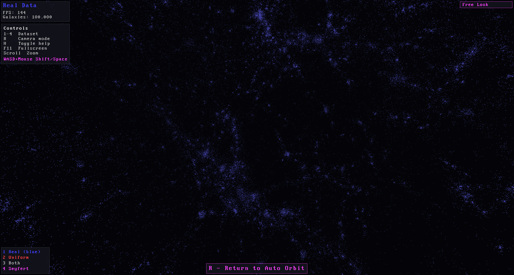
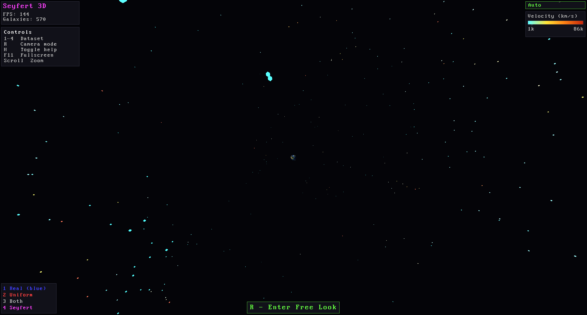

# Galaxy Visualization

## The Course

This project visualizes 100,000 real galaxies in blue and 100,000 randomly distributed galaxies in red. The data is sourced from the GPU programming course at: [Åbo Akademi University](https://studiehandboken.abo.fi/en/course/IT00CG19/19162?period=2024-2027)

The assignment is to use parallel programming with CUDA (or HIP) to calculate 10 billion angles between galaxies and prove they are not randomly distributed. 
The students must leverage the GPU for these calculations on their own using a smaller compute cluster or supercomputer.

### Note:
- The students have to prove this on their own.
- The expected runtime for the calculation is approximately 3 seconds.
    - It is possible to optimize the runtime to 0.85 seconds on a single GPU (my own solution tested with one AMD RX 6900 XT).
- **This program is a visualization of the data, not the solution to the assignment.**
- Additional redshift data from various surveys has been included for visualization purposes.

## Prerequisites

This project can be built using clang/gcc through build.sh (raylib is the only dependency) or Meson as the build system.

## Dependencies

- **Git**
- **Base Development Tools** (e.g. `build-essential` on Ubuntu)
- **Raylib** (Tested with v5.5-1)
- **Clang**  (or GCC)
- **Meson**  (optional)
- **Python3** (optional, for embedded build compression)
- **gdb**    (optional)
- **ImageMagick** (required for Windows icon embedding in mingw builds)

## Installation Commands

### Arch Linux

```bash
sudo pacman -S raylib base-devel meson git clang python imagemagick
```

### Ubuntu

```bash
sudo apt-get install -y raylib build-essential meson git clang python3 imagemagick
```

## Building

You can choose between two build modes:
- **Normal build**: External asset files (45 KB binary + ~8 MB assets)
- **Embedded build**: Single portable binary with all assets compressed (~6 MB)
- **Static raylib (optional)**: Links raylib statically while keeping system libraries dynamic

### Using build.sh

```bash
# Make executable
chmod +x ./build.sh

# (Optional) download raylib subproject for static linking
meson subprojects download raylib

# Normal build (with external assets)
./build.sh

# Embedded build (single portable binary)
./build.sh --embed

# Embedded + static raylib
./build.sh --embed --static

# Build and run
./build.sh --run
./build.sh --embed --run

# Clean and rebuild
./build.sh --clean

# Show all options
./build.sh --help
```

### Using Meson

```bash
# Normal build
meson setup build
meson compile -C build
./build/galaxy_visualization_raylib

# Embedded build (single portable binary)
meson setup build_embedded -Dembed_assets=true
meson compile -C build_embedded
./build_embedded/galaxy_visualization_raylib  # Can run from anywhere!

# Embedded + static raylib (system libs still dynamic)
meson subprojects download raylib
meson setup build_embedded_static -Dembed_assets=true -Draylib_static=true
meson compile -C build_embedded_static

# Clean
meson compile -C build --clean
```

If your system package does not provide a static raylib, use the Meson wrap subproject:

- Run: `meson subprojects download raylib`
- Meson will use the subproject when `-Draylib_static=true` is used


### Cross-compiling for Windows (mingw64)

Install a mingw64 toolchain, then:

```bash
# Download raylib subproject (required for static linking)
meson subprojects download raylib

# Configure and build Windows .exe (embedded + static raylib)
meson setup build_mingw_embedded_static --cross-file ./cross/mingw64.ini -Dembed_assets=true -Draylib_static=true
meson compile -C build_mingw_embedded_static
```

Notes:
- Windows builds embed the app icon into the .exe using ImageMagick during the build.

Or using build.sh:

```bash
./build.sh --mingw
```

### Build Options

| Option | Description | Binary Size |
|--------|-------------|-------------|
| Normal | External assets required | ~45 KB |
| Embedded (`--embed` or `-Dembed_assets=true`) | All assets compressed into binary | ~6 MB |
| Static raylib (`--static` or `-Draylib_static=true`) | raylib linked statically, system libs dynamic | Varies |


The embedded binary includes:
- Fonts, shaders, and 3D models
- All galaxy data (100k points × 2 datasets)
- Redshift survey data (Seyfert + SAGA DR3)
- Compressed with zlib (~40-50% compression ratio for text data)

## Examples




---

## Data Sources & Attribution

This repository contains **code and derived galaxy redshift data**.  
All original data are the property of their respective surveys and authors.  
This project **does not claim credit for the original data**.

### CfA Redshift Survey

- **Original source:** ZCAT, Harvard–Smithsonian Center for Astrophysics  
- **URL:** [https://lweb.cfa.harvard.edu/~dfabricant/huchra/zcat/](https://lweb.cfa.harvard.edu/~dfabricant/huchra/zcat/)  
- **Modifications:** Only essential fields retained (e.g., galaxy ID and redshift); extraneous data removed for this project.

**Reference:**  

> Huchra, J., Davis, M., Latham, D., & Tonry, J. (1983).  
> *A survey of galaxy redshifts. I.*  
> **Astrophysical Journal Supplement Series**, 52, 89.  
> [ADS link](https://ui.adsabs.harvard.edu/abs/1983ApJS...52...89H)

---

### SAGA Survey

- **Original source:** SAGA Survey III — Satellite Systems around Milky Way–mass Galaxies  
- **URL / DOI:** [DOI:10.3847/1538-4357/ad64c4](https://doi.org/10.3847/1538-4357/ad64c4)  
- **Modifications:** Only published redshifts relevant to this project are included; all other data excluded.

**Reference:**  

> Mao, Y.-Y., Geha, M., Wechsler, R. H., Asali, Y., Wang, Y., Kado-Fong, E., Kallivayalil, N., Nadler, E. O., Tollerud, E. J., Weiner, B., de los Reyes, M. A. C., & Wu, J. F. (2024).  
> *The SAGA Survey. III. A Census of 101 Satellite Systems around Milky Way–mass Galaxies.*  
> **The Astrophysical Journal**, 976(1), 117.  
> [ADS link](https://ui.adsabs.harvard.edu/abs/2024ApJ...976..117M) | [arXiv:2404.14498](https://arxiv.org/abs/2404.14498)

---

### Usage & Citation

- This repository contains **code and derived datasets only**.  
- **Original surveys must always be cited** when using the included redshift data.  
- If you use this repository for code or its cleaned dataset, you may cite it via the [`CITATION.cff`](CITATION.cff) file—but this does **not replace citing the original surveys**.


## License
MIT License - see the [LICENSE](LICENSE) file for details